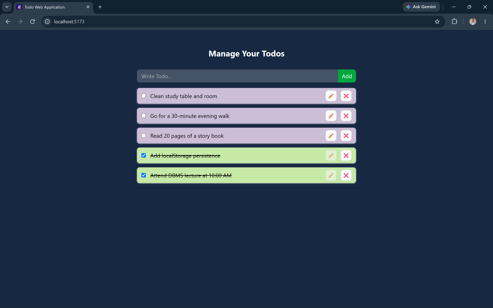

# 📝 Todo Web Application

A modern and responsive Todo Web Application built with **React**, **Context API**, and **Local Storage**.
The application allows users to create, edit, delete, and mark tasks as completed while automatically saving data in the browser.

---

## 🚀 Features

* ➕ Add new todos
* ✏️ Edit existing todos
* 🗑️ Delete todos
* ✅ Mark todos as completed/incomplete
* 💾 Persist data using **Local Storage**
* ⚡ Real-time UI updates with React state management
* 📱 Responsive and user-friendly interface

---

## 🛠️ Technologies Used

* **React**
* **Vite**
* **Context API**
* **Tailwind CSS**
* **JavaScript (ES6+)**
* **Local Storage API**

---

## 📂 Project Structure

```text id="r5qt1t"
src/
├── components/
│   ├── TodoForm.jsx
│   ├── TodoItem.jsx
│
├── context/
│   ├── index.js
│   ├── TodoContext.js
│
├── App.jsx
├── main.jsx
└── index.css
```

---

## ⚙️ Installation

Clone the repository and install dependencies.

```bash id="lmq34s"
git clone <repository-url>
cd <project-folder>
npm install
```

---

## ▶️ Run the Application

```bash id="p4l4jo"
npm run dev
```

Open the URL displayed in the terminal (usually `http://localhost:5173`).

---

## 📸 Application Screenshot



## 🧠 Functionality Overview

### Add Todo

Creates a new todo with a unique timestamp-based ID and adds it to the top of the list.

### Update Todo

Updates the matching todo while keeping all other todos unchanged.

### Delete Todo

Removes the selected todo from the list.

### Toggle Completion

Switches the completion status of a todo between completed and incomplete.

### Local Storage Persistence

Todos are automatically:

* loaded from local storage when the app starts
* saved to local storage whenever the todo list changes

---

## 👨‍💻 Author

**Sayan Dan**

If you found this project helpful, feel free to ⭐ the repository.
